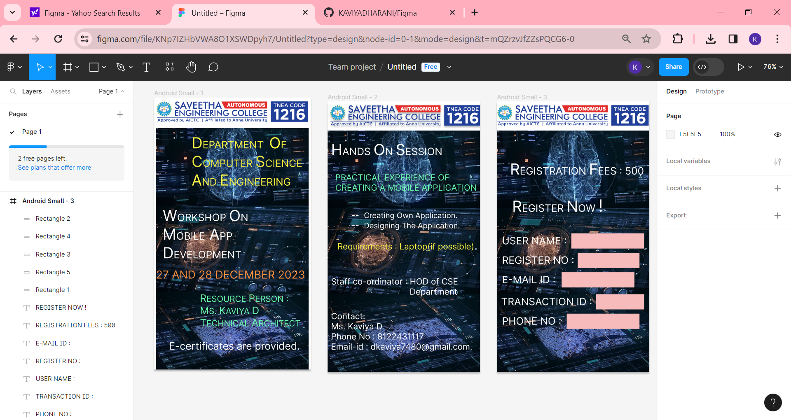

# Ex09 Event Registration Web Application
## Date: 27/12/2023

## AIM:
To design, develop and deploy a web application for event registration.

## DESIGN STEPS:

### Step 1:
Create a new frame.

### Step 2:
Select any one preset size of your choice.

### Step 3:
Select the shapes you need.

### Step 4:
Import images as needed.

### Step 5:
Create pages based on your need and link them.

### Step 6:

Validate the HTML and CSS code.

### Step 6:

Publish the website in the given URL.

## DESIGN TOOL:
Figma

## CODE:
```
Home Page

<div style="width: 100%; height: 100%; position: relative; background: white; box-shadow: 0px 4px 4px rgba(0, 0, 0, 0.25)">
    
    <div style="left: 35px; top: 573px; position: absolute; color: white; font-size: 24px; font-family: Inter; font-weight: 400; word-wrap: break-word">E-certificates are provided.</div>
    <div style="width: 340px; height: 120px; left: 20px; top: 257px; position: absolute"><span style="color: white; font-size: 36px; font-family: Inter; font-weight: 400; word-wrap: break-word">W</span><span style="color: white; font-size: 24px; font-family: Inter; font-weight: 400; word-wrap: break-word">ORKSHOP </span><span style="color: white; font-size: 36px; font-family: Inter; font-weight: 400; word-wrap: break-word">O</span><span style="color: white; font-size: 24px; font-family: Inter; font-weight: 400; word-wrap: break-word">N<br/></span><span style="color: white; font-size: 36px; font-family: Inter; font-weight: 400; word-wrap: break-word">M</span><span style="color: white; font-size: 24px; font-family: Inter; font-weight: 400; word-wrap: break-word">OBILE</span><span style="color: white; font-size: 36px; font-family: Inter; font-weight: 400; word-wrap: break-word"> A</span><span style="color: white; font-size: 24px; font-family: Inter; font-weight: 400; word-wrap: break-word">PP </span><span style="color: white; font-size: 36px; font-family: Inter; font-weight: 400; word-wrap: break-word">D</span><span style="color: white; font-size: 24px; font-family: Inter; font-weight: 400; word-wrap: break-word">EVELOPMENT<br/></span></div>
    
    <div style="width: 302px; height: 136px; left: 58px; top: 85px; position: absolute"><span style="color: #FEF743; font-size: 36px; font-family: Inter; font-weight: 400; word-wrap: break-word">   D</span><span style="color: #FEF743; font-size: 24px; font-family: Inter; font-weight: 400; word-wrap: break-word">EPARTMENT  </span><span style="color: #FEF743; font-size: 36px; font-family: Inter; font-weight: 400; word-wrap: break-word">O</span><span style="color: #FEF743; font-size: 24px; font-family: Inter; font-weight: 400; word-wrap: break-word">F<br/></span><span style="color: #EBE43B; font-size: 36px; font-family: Inter; font-weight: 400; word-wrap: break-word">   C</span><span style="color: #EBE43B; font-size: 24px; font-family: Inter; font-weight: 400; word-wrap: break-word">OMPUTER </span><span style="color: #EBE43B; font-size: 36px; font-family: Inter; font-weight: 400; word-wrap: break-word">S</span><span style="color: #EBE43B; font-size: 24px; font-family: Inter; font-weight: 400; word-wrap: break-word">CIENCE <br/></span><span style="color: #FEF743; font-size: 36px; font-family: Inter; font-weight: 400; word-wrap: break-word">   A</span><span style="color: #FEF743; font-size: 24px; font-family: Inter; font-weight: 400; word-wrap: break-word">ND </span><span style="color: #FEF743; font-size: 36px; font-family: Inter; font-weight: 400; word-wrap: break-word">E</span><span style="color: #FEF743; font-size: 24px; font-family: Inter; font-weight: 400; word-wrap: break-word">NGINEERING<br/></span></div>
    <div style="left: 108px; top: 460px; position: absolute"><span style="color: #69FAAC; font-size: 24px; font-family: Inter; font-weight: 400; word-wrap: break-word">R</span><span style="color: #69FAAC; font-size: 20px; font-family: Inter; font-weight: 400; word-wrap: break-word">ESOURCE </span><span style="color: #69FAAC; font-size: 24px; font-family: Inter; font-weight: 400; word-wrap: break-word">P</span><span style="color: #69FAAC; font-size: 20px; font-family: Inter; font-weight: 400; word-wrap: break-word">ERSON :<br/></span><span style="color: #69FAAC; font-size: 24px; font-family: Inter; font-weight: 400; word-wrap: break-word">M</span><span style="color: #69FAAC; font-size: 20px; font-family: Inter; font-weight: 400; word-wrap: break-word">S. </span><span style="color: #69FAAC; font-size: 24px; font-family: Inter; font-weight: 400; word-wrap: break-word">K</span><span style="color: #69FAAC; font-size: 20px; font-family: Inter; font-weight: 400; word-wrap: break-word">AVIYA </span><span style="color: #69FAAC; font-size: 24px; font-family: Inter; font-weight: 400; word-wrap: break-word">D<br/>T</span><span style="color: #69FAAC; font-size: 20px; font-family: Inter; font-weight: 400; word-wrap: break-word">ECHNICAL </span><span style="color: #69FAAC; font-size: 24px; font-family: Inter; font-weight: 400; word-wrap: break-word">A</span><span style="color: #69FAAC; font-size: 20px; font-family: Inter; font-weight: 400; word-wrap: break-word">RCHITECT</span></div>
    <div style="left: 4px; top: 403px; position: absolute; color: #FF8F3D; font-size: 26px; font-family: Inter; font-weight: 400; word-wrap: break-word">27 AND 28 DECEMBER 2023</div>
</div>

// E-certificates are provided.
color: white;
 font-size: 24px;
 font-family: Inter;
 font-weight: 400;
 word-wrap: break-word
---
// W
color: white;
 font-size: 36px;
 font-family: Inter;
 font-weight: 400;
 word-wrap: break-word
---
// ORKSHOP 
color: white;
 font-size: 24px;
 font-family: Inter;
 font-weight: 400;
 word-wrap: break-word
---
// O
color: white;
 font-size: 36px;
 font-family: Inter;
 font-weight: 400;
 word-wrap: break-word
---
// N<br/>
color: white;
 font-size: 24px;
 font-family: Inter;
 font-weight: 400;
 word-wrap: break-word
---
// M
color: white;
 font-size: 36px;
 font-family: Inter;
 font-weight: 400;
 word-wrap: break-word
---
// OBILE
color: white;
 font-size: 24px;
 font-family: Inter;
 font-weight: 400;
 word-wrap: break-word
---
//  A
color: white;
 font-size: 36px;
 font-family: Inter;
 font-weight: 400;
 word-wrap: break-word
---
// PP 
color: white;
 font-size: 24px;
 font-family: Inter;
 font-weight: 400;
 word-wrap: break-word
---
// D
color: white;
 font-size: 36px;
 font-family: Inter;
 font-weight: 400;
 word-wrap: break-word
---
// EVELOPMENT<br/>
color: white;
 font-size: 24px;
 font-family: Inter;
 font-weight: 400;
 word-wrap: break-word
---
//    D
color: #FEF743;
 font-size: 36px;
 font-family: Inter;
 font-weight: 400;
 word-wrap: break-word
---
// EPARTMENT  
color: #FEF743;
 font-size: 24px;
 font-family: Inter;
 font-weight: 400;
 word-wrap: break-word
---
// O
color: #FEF743;
 font-size: 36px;
 font-family: Inter;
 font-weight: 400;
 word-wrap: break-word
---
// F<br/>
color: #FEF743;
 font-size: 24px;
 font-family: Inter;
 font-weight: 400;
 word-wrap: break-word
---
//    C
color: #EBE43B;
 font-size: 36px;
 font-family: Inter;
 font-weight: 400;
 word-wrap: break-word
---
// OMPUTER 
color: #EBE43B;
 font-size: 24px;
 font-family: Inter;
 font-weight: 400;
 word-wrap: break-word
---
// S
color: #EBE43B;
 font-size: 36px;
 font-family: Inter;
 font-weight: 400;
 word-wrap: break-word
---
// CIENCE <br/>
color: #EBE43B;
 font-size: 24px;
 font-family: Inter;
 font-weight: 400;
 word-wrap: break-word
---
//    A
color: #FEF743;
 font-size: 36px;
 font-family: Inter;
 font-weight: 400;
 word-wrap: break-word
---
// ND 
color: #FEF743;
 font-size: 24px;
 font-family: Inter;
 font-weight: 400;
 word-wrap: break-word
---
// E
color: #FEF743;
 font-size: 36px;
 font-family: Inter;
 font-weight: 400;
 word-wrap: break-word
---
// NGINEERING<br/>
color: #FEF743;
 font-size: 24px;
 font-family: Inter;
 font-weight: 400;
 word-wrap: break-word
---
// R
color: #69FAAC;
 font-size: 24px;
 font-family: Inter;
 font-weight: 400;
 word-wrap: break-word
---
// ESOURCE 
color: #69FAAC;
 font-size: 20px;
 font-family: Inter;
 font-weight: 400;
 word-wrap: break-word
---
// P
color: #69FAAC;
 font-size: 24px;
 font-family: Inter;
 font-weight: 400;
 word-wrap: break-word
---
// ERSON :<br/>
color: #69FAAC;
 font-size: 20px;
 font-family: Inter;
 font-weight: 400;
 word-wrap: break-word
---
// M
color: #69FAAC;
 font-size: 24px;
 font-family: Inter;
 font-weight: 400;
 word-wrap: break-word
---
// S. 
color: #69FAAC;
 font-size: 20px;
 font-family: Inter;
 font-weight: 400;
 word-wrap: break-word
---
// K
color: #69FAAC;
 font-size: 24px;
 font-family: Inter;
 font-weight: 400;
 word-wrap: break-word
---
// AVIYA 
color: #69FAAC;
 font-size: 20px;
 font-family: Inter;
 font-weight: 400;
 word-wrap: break-word
---
// D<br/>T
color: #69FAAC;
 font-size: 24px;
 font-family: Inter;
 font-weight: 400;
 word-wrap: break-word
---
// ECHNICAL 
color: #69FAAC;
 font-size: 20px;
 font-family: Inter;
 font-weight: 400;
 word-wrap: break-word
---
// A
color: #69FAAC;
 font-size: 24px;
 font-family: Inter;
 font-weight: 400;
 word-wrap: break-word
---
// RCHITECT
color: #69FAAC;
 font-size: 20px;
 font-family: Inter;
 font-weight: 400;
 word-wrap: break-word
---
// 27 AND 28 DECEMBER 2023
color: #FF8F3D;
 font-size: 26px;
 font-family: Inter;
 font-weight: 400;
 word-wrap: break-word

Page 2

<div style="width: 100%; height: 100%; position: relative; background: white; box-shadow: 0px 4px 4px rgba(0, 0, 0, 0.25)">
    
    
    <div style="left: 8px; top: 414px; position: absolute; color: white; font-size: 20px; font-family: Inter; font-weight: 400; word-wrap: break-word">Staff co-ordinator : HOD of CSE <br/>                                 Department<br/></div>
    <div style="left: 23px; top: 331px; position: absolute; color: #FEF743; font-size: 20px; font-family: Inter; font-weight: 400; word-wrap: break-word">Requirements : Laptop(if possible)</div>
    <div style="left: 18px; top: 168px; position: absolute; color: #69FAAC; font-size: 20px; font-family: Inter; font-weight: 400; word-wrap: break-word">PRACTICAL EXPERIENCE OF <br/>CREATING A MOBILE APPLICATION</div>
    <div style="left: 8px; top: 92px; position: absolute"><span style="color: white; font-size: 36px; font-family: Inter; font-weight: 400; word-wrap: break-word">H</span><span style="color: white; font-size: 24px; font-family: Inter; font-weight: 400; word-wrap: break-word">ANDS </span><span style="color: white; font-size: 36px; font-family: Inter; font-weight: 400; word-wrap: break-word">O</span><span style="color: white; font-size: 24px; font-family: Inter; font-weight: 400; word-wrap: break-word">N </span><span style="color: white; font-size: 36px; font-family: Inter; font-weight: 400; word-wrap: break-word">S</span><span style="color: white; font-size: 24px; font-family: Inter; font-weight: 400; word-wrap: break-word">ESSION</span></div>
    <div style="left: 56px; top: 257px; position: absolute"><span style="color: white; font-size: 20px; font-family: Inter; font-weight: 400; word-wrap: break-word">--  </span><span style="color: white; font-size: 18px; font-family: Inter; font-weight: 400; word-wrap: break-word">Creating Own Application.<br/></span><span style="color: white; font-size: 20px; font-family: Inter; font-weight: 400; word-wrap: break-word">--  </span><span style="color: white; font-size: 18px; font-family: Inter; font-weight: 400; word-wrap: break-word">Designing The Application.</span></div>
    <div style="left: 8px; top: 496px; position: absolute; color: white; font-size: 20px; font-family: Inter; font-weight: 400; word-wrap: break-word">Contact:<br/>Ms. Kaviya D <br/>Phone No : 8122431117<br/>Email-id : dkaviya7480@gmail.com.</div>
</div>

// Staff co-ordinator : HOD of CSE <br/>                                 Department<br/>
color: white;
 font-size: 20px;
 font-family: Inter;
 font-weight: 400;
 word-wrap: break-word
---
// Requirements : Laptop(if possible)
color: #FEF743;
 font-size: 20px;
 font-family: Inter;
 font-weight: 400;
 word-wrap: break-word
---
// PRACTICAL EXPERIENCE OF <br/>CREATING A MOBILE APPLICATION
color: #69FAAC;
 font-size: 20px;
 font-family: Inter;
 font-weight: 400;
 word-wrap: break-word
---
// H
color: white;
 font-size: 36px;
 font-family: Inter;
 font-weight: 400;
 word-wrap: break-word
---
// ANDS 
color: white;
 font-size: 24px;
 font-family: Inter;
 font-weight: 400;
 word-wrap: break-word
---
// O
color: white;
 font-size: 36px;
 font-family: Inter;
 font-weight: 400;
 word-wrap: break-word
---
// N 
color: white;
 font-size: 24px;
 font-family: Inter;
 font-weight: 400;
 word-wrap: break-word
---
// S
color: white;
 font-size: 36px;
 font-family: Inter;
 font-weight: 400;
 word-wrap: break-word
---
// ESSION
color: white;
 font-size: 24px;
 font-family: Inter;
 font-weight: 400;
 word-wrap: break-word
---
// --  
color: white;
 font-size: 20px;
 font-family: Inter;
 font-weight: 400;
 word-wrap: break-word
---
// Creating Own Application.<br/>
color: white;
 font-size: 18px;
 font-family: Inter;
 font-weight: 400;
 word-wrap: break-word
---
// --  
color: white;
 font-size: 20px;
 font-family: Inter;
 font-weight: 400;
 word-wrap: break-word
---
// Designing The Application.
color: white;
 font-size: 18px;
 font-family: Inter;
 font-weight: 400;
 word-wrap: break-word
---
// Contact:<br/>Ms. Kaviya D <br/>Phone No : 8122431117<br/>Email-id : dkaviya7480@gmail.com.
color: white;
 font-size: 20px;
 font-family: Inter;
 font-weight: 400;
 word-wrap: break-word

Page 3

<div style="width: 100%; height: 100%; position: relative; background: white; box-shadow: 0px 4px 4px rgba(0, 0, 0, 0.25)">
    
    
    <div style="left: 12px; top: 505px; position: absolute; color: white; font-size: 24px; font-family: Inter; font-weight: 400; word-wrap: break-word">PHONE NO :</div>
    <div style="width: 216px; height: 29px; left: 10px; top: 459px; position: absolute; color: white; font-size: 24px; font-family: Inter; font-weight: 400; word-wrap: break-word">TRANSACTION ID :</div>
    <div style="left: 12px; top: 315px; position: absolute; color: white; font-size: 24px; font-family: Inter; font-weight: 400; word-wrap: break-word">USER NAME :</div>
    <div style="left: 12px; top: 361px; position: absolute; color: white; font-size: 24px; font-family: Inter; font-weight: 400; word-wrap: break-word">REGISTER NO :</div>
    <div style="left: 12px; top: 407px; position: absolute; color: white; font-size: 24px; font-family: Inter; font-weight: 400; word-wrap: break-word">E-MAIL ID :</div>
    <div style="left: 31px; top: 138px; position: absolute"><span style="color: white; font-size: 36px; font-family: Inter; font-weight: 400; word-wrap: break-word">R</span><span style="color: white; font-size: 24px; font-family: Inter; font-weight: 400; word-wrap: break-word">EGISTRATION </span><span style="color: white; font-size: 36px; font-family: Inter; font-weight: 400; word-wrap: break-word">F</span><span style="color: white; font-size: 24px; font-family: Inter; font-weight: 400; word-wrap: break-word">EES : 500</span></div>
    <div style="left: 36px; top: 222px; position: absolute"><span style="color: white; font-size: 36px; font-family: Inter; font-weight: 400; word-wrap: break-word">R</span><span style="color: white; font-size: 24px; font-family: Inter; font-weight: 400; word-wrap: break-word">EGISTER </span><span style="color: white; font-size: 36px; font-family: Inter; font-weight: 400; word-wrap: break-word">N</span><span style="color: white; font-size: 24px; font-family: Inter; font-weight: 400; word-wrap: break-word">OW </span><span style="color: white; font-size: 40px; font-family: Inter; font-weight: 400; word-wrap: break-word">!</span></div>
    <div style="width: 172px; height: 36px; left: 176px; top: 312px; position: absolute; background: #F7BBBB"></div>
    <div style="width: 114px; height: 36px; left: 234px; top: 456px; position: absolute; background: #F7BBBB"></div>
    <div style="width: 146px; height: 36px; left: 191px; top: 358px; position: absolute; background: #F7BBBB"></div>
    <div style="width: 172px; height: 36px; left: 165px; top: 502px; position: absolute; background: #F7BBBB"></div>
    <div style="width: 172px; height: 36px; left: 153px; top: 404px; position: absolute; background: #F7BBBB"></div>
</div>

// PHONE NO :
color: white;
 font-size: 24px;
 font-family: Inter;
 font-weight: 400;
 word-wrap: break-word
---
// TRANSACTION ID :
color: white;
 font-size: 24px;
 font-family: Inter;
 font-weight: 400;
 word-wrap: break-word
---
// USER NAME :
color: white;
 font-size: 24px;
 font-family: Inter;
 font-weight: 400;
 word-wrap: break-word
---
// REGISTER NO :
color: white;
 font-size: 24px;
 font-family: Inter;
 font-weight: 400;
 word-wrap: break-word
---
// E-MAIL ID :
color: white;
 font-size: 24px;
 font-family: Inter;
 font-weight: 400;
 word-wrap: break-word
---
// R
color: white;
 font-size: 36px;
 font-family: Inter;
 font-weight: 400;
 word-wrap: break-word
---
// EGISTRATION 
color: white;
 font-size: 24px;
 font-family: Inter;
 font-weight: 400;
 word-wrap: break-word
---
// F
color: white;
 font-size: 36px;
 font-family: Inter;
 font-weight: 400;
 word-wrap: break-word
---
// EES : 500
color: white;
 font-size: 24px;
 font-family: Inter;
 font-weight: 400;
 word-wrap: break-word
---
// R
color: white;
 font-size: 36px;
 font-family: Inter;
 font-weight: 400;
 word-wrap: break-word
---
// EGISTER 
color: white;
 font-size: 24px;
 font-family: Inter;
 font-weight: 400;
 word-wrap: break-word
---
// N
color: white;
 font-size: 36px;
 font-family: Inter;
 font-weight: 400;
 word-wrap: break-word
---
// OW 
color: white;
 font-size: 24px;
 font-family: Inter;
 font-weight: 400;
 word-wrap: break-word
---
// !
color: white;
 font-size: 40px;
 font-family: Inter;
 font-weight: 400;
 word-wrap: break-word
```
## OUTPUT:



## RESULT:
The program to design, develop and deploy a web application for event registration is completed successfully.
